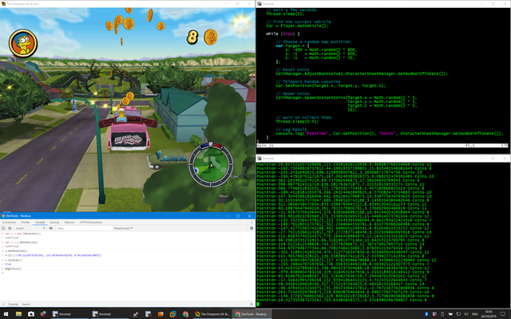
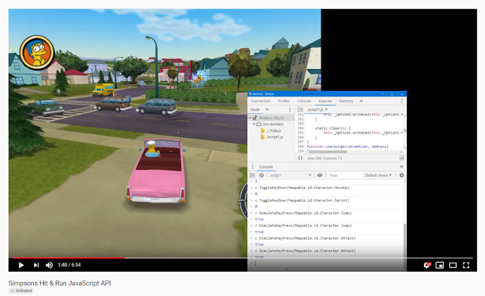

# Simpsons: Hit & Run API

> This code is in a pre-pre-pre-alpha experimental state.

This is a library to allow automating and manipulating the game Simpsons: Hit &
Run with JavaScript. It uses the frida library to instrument and access
internal state.

[](doc/fuzzing.png)


Want to see it in action? Here is an early demo video.

[](https://www.youtube.com/watch?v=cpmvSQ2l3Nc)


# Installation

You need [frida](https://frida.re/) intalled, if you already have python it
couldn't be easier, something like:

```
pip install frida-tools
```

The full frida install documentation is
[here](https://www.frida.re/docs/installation/) if you need it.

> Note: You must be using python for Windows, not WSL python.

Now just type

```
$ make
```

If you don't have WSL, you can do this instead:

```
> type *.js > scriptfile.out.js
```

# Usage

Run the game `Simpsons.exe`, you can use the launcher if you like, and type this:


```
python.exe inject.py Simpsons.exe
```

If you don't get any error messages, then frida was started and was injected
into the game. To interact with it, open chrome and go to `chrome://inspect`
and click the `Open dedicated DevTools for Node` link.

You should now have a JavaScript console connected.

Try it out!

Type this:

```
CoinManager.SpawnInstantCoins(0, 0, 0, 10)
```

Some coins should fly towards you.

Get into a car, and type this:

```
var v = (new Character()).GetVehicle()
var p = v.GetPosition()

// p is [x, y, z] co-ordinates of the car.
p.z += 10

v.SetPosition(p)
```

Your car should jump 100 ft in the air.

Simulate keyboard input events. Note: I'm working on this API, it will be
easier when finished!

```
// Find the active Controller
var c = InputManager.GetController();

// Say that button 'MoveUp' is now down
c.GetMappable(1).ToggleKeyDown(Mappable.id.Character.MoveUp);

// Simulate a key press.
c.SimulateKeyPress(Mappable.id.Character.Jump)
```

# Notes

I'm using the binary with md5 `9009afe5ab6c2daf8605d8b613951902`.


